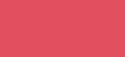
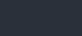

# Com s'ha fet?

## Llenguatges utilitzats
- html
- css
- javascript
- markdown

## Estructura del projecte
- web
  - css
    - style.css
  - javascript
    - script.js
  - img
    - ...
    - ...
    - ...
  - html
    - comshafet.html
  - index.html

## Colors principals del projecte

    - #000000

    - #ffffff

    - #d94f5c

    - #2b303a

## Pàgines web visitades
- https://www.w3schools.com/
- https://developer.mozilla.org/es/docs/Web
- https://codepen.io/